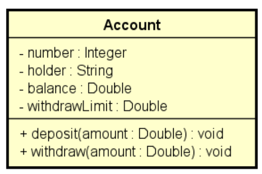

# Exceptions Study case: Bank Account 

In this project, the case is a bank account. I had to create a new exception to catch two problems: withdraw amount major than the amount available on user's account and a withdraw amount major than the withdraw limit per account. 

# Class project

